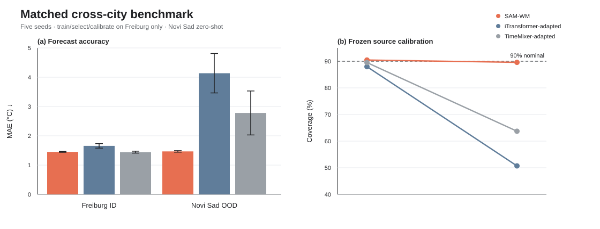
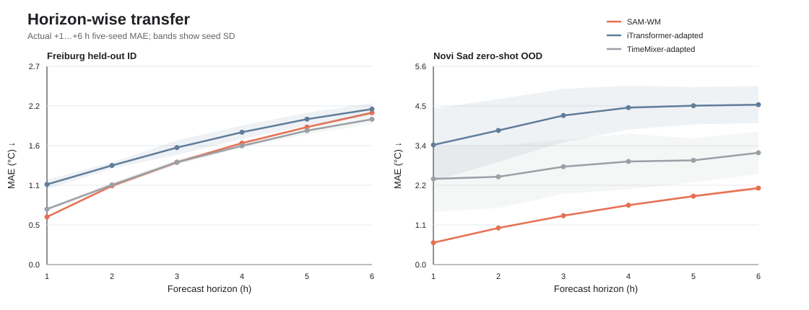
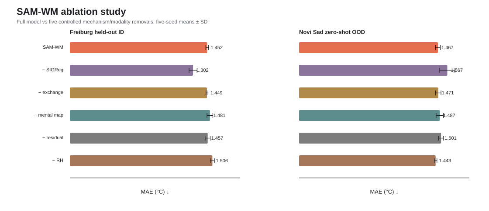
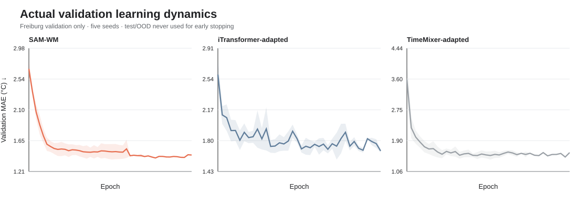
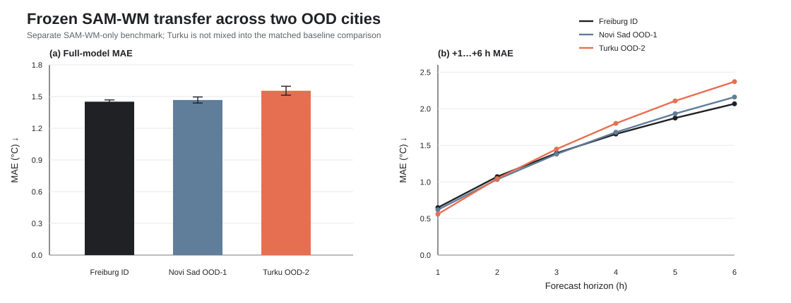
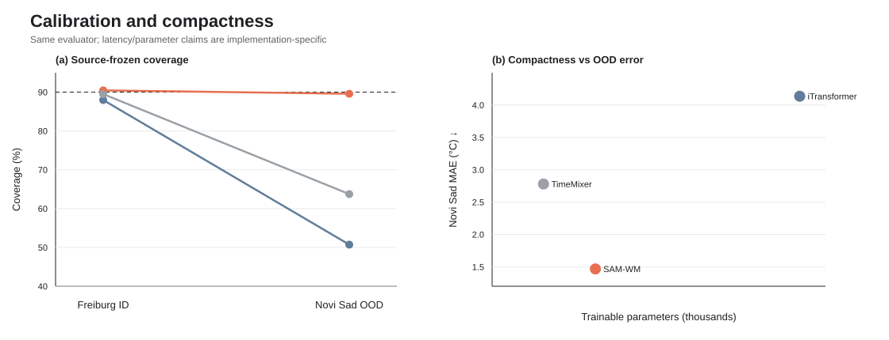

# SAM-WM · CoolWorld
### Sparse Adaptive Mechanism World Model for urban thermal forecasting

**Krsna · FortyGuard Hackathon 2026 · Resilient Cities & Infrastructure**

**Abstract.** CoolWorld turns real urban thermal evidence into short-horizon heat forecasts and hotspot priorities using **SAM-WM**, a compact 117,705-parameter world model. SAM-WM represents a city as a sparse physical graph and rolls temperature forward with a learned composition of local exchange, transport, source/sink and bounded residual mechanisms. The model also predicts uncertainty and keeps forecast evidence separate from claims about intervention effects. In a five-seed matched suite trained, selected and calibrated only on Freiburg, SAM-WM obtains **1.4515 ± 0.0149 °C MAE** on Freiburg held-out data and **1.4675 ± 0.0256 °C MAE** on zero-shot Novi Sad. Under the same protocol, the matched iTransformer-adapted and TimeMixer-adapted baselines degrade to **4.1367 ± 0.6737 °C** and **2.7799 ± 0.7516 °C** respectively on Novi Sad. The result supports the intended **cross-city preservation** hypothesis; it does not establish universal SOTA or causal cooling.

<p align="center">
  <b>[ <a href="https://sam-wm-coolworld.onrender.com">Live Demo</a> · <a href="results/paper_suite/paper_suite_results.json">Results</a> · <a href="docs/RESEARCH_POSITIONING.md">Research Audit</a> · <a href="docs/KAGGLE_PAPER_SUITE.md">Reproduce</a> ]</b>
</p>

<p align="center">
  
</p>

> **Claim boundary.** CoolWorld does not physically cool a city. Physical interventions such as shade, trees, reflective materials, water systems or retrofits do. SAM-WM forecasts where heat is likely to persist. Numerical intervention effects remain locked until independent treated/control evidence exists.

## What is original here?

SAM-WM is not a renamed copy of LeWM, iTransformer or TimeMixer. The original contribution is the **mechanism factorization used to model a sparse continuous urban thermal field**.

Let a city be a graph \(G=(V,E)\), with temperature \(T_i^t\) and latent state \(z_i^t\) at sensor/tile \(i\). SAM-WM predicts the next field through a routed sum

\[
T_i^{t+1}=T_i^t+\Delta_i^{\mathrm{ex}}+\Delta_i^{\mathrm{wind}}+\Delta_i^{\mathrm{src}}+\Delta_i^{\mathrm{res}}.
\]

The router is learned from the latent state and time features, while each term has a deliberately different role:

- **Sparse adaptive mental map.** `O(E)` state-dependent message passing over a deterministic physical kNN graph.
- **Conservative exchange.** Pair flux is antisymmetric. For edge \((i,j)\), the learned non-negative symmetric conductance gives \(F_{ij}=k_{ij}(T_j-T_i)\), so the exchange update satisfies \(\sum_i\Delta_i^{\mathrm{ex}}\approx0\) up to floating-point error.
- **Wind transport.** A conservative upwind operator when observed wind is available; the route is disabled when wind is unavailable.
- **Bounded source/sink.** Learned local forcing is clipped by a source-domain one-step bound instead of being unconstrained.
- **Bounded residual.** Free correction capacity is intentionally limited, leaving the typed operators responsible for most of the rollout.
- **Adaptive mechanism routing.** The model changes the relative contribution of exchange, transport, source and residual mechanisms with state and time.
- **Recurrent latent rollout.** A GRU state advances jointly with the temperature field for +1…+6 h prediction.
- **Uncertainty and surprise.** A learned Laplace scale is calibrated with Freiburg validation residuals; the same frozen calibration is carried to OOD evaluation.

SIGReg is **not** claimed as an original SAM-WM contribution. SIGReg was introduced in LeJEPA (Balestriero and LeCun, 2025); SAM-WM uses an attributed adaptation of the public LeWM/LeJEPA regularization path alongside its own sparse mechanism architecture.

This is a **mechanism-structured modelling hypothesis**, not a new physical law and not a complete first-principles surface-energy-balance simulator. Exchange and wind transport are conservative; source and residual terms can add or remove energy-like forcing, so the complete model is not globally energy-conserving.

## How CoolWorld uses it

```text
REAL FORTYGUARD THERMAL EVIDENCE
65 recorded hourly frames · one 36-tile San José grid
                    │
                    ▼
               OBSERVE IN 3D
measured field + timestamp + provenance
                    │
                    ▼
                  SAM-WM
48 h context → sparse graph → routed mechanisms → +1…+6 h rollout
                    │
                    ▼
            PRIORITIZE HOTSPOTS
future temperature + persistence + uncertainty
                    │
                    ▼
             ENGINEERING REVIEW
shade / canopy / reflective surface / other physical action
                    │
                    ▼
          MEASURE TREATED VS CONTROL
                    │
                    ▼
             VALIDATE OR ABSTAIN
```

The application keeps four states separate: **observed evidence**, **research forecast**, **operational certification**, and **causal intervention evidence**. A forecast can be scientifically useful without being operationally certified, and neither state proves that a proposed intervention will cool a location.

## Repository structure

```text
SAM-WM/
├── src/coolworld/
│   ├── samwm.py                         # original SAM-WM architecture + loss
│   ├── ablations.py                     # five controlled SAM-WM ablations
│   ├── baselines/
│   │   ├── itransformer_adapter.py      # matched iTransformer-inspired baseline
│   │   └── timemixer_adapter.py         # matched TimeMixer-inspired baseline
│   ├── paper_models.py                  # benchmark registry / compatibility layer
│   ├── paper_suite.py                   # five-seed train/select/calibrate/evaluate protocol
│   ├── graph.py                         # sparse physical city graph
│   ├── experiment.py                    # checkpointing and evaluation mechanics
│   ├── provider.py                      # immutable FortyGuard evidence/replay
│   ├── candra.py                        # treated/control causal evidence gate
│   └── app.py                           # FastAPI runtime
├── artifacts/deployment/
│   └── best.pt                          # promoted SAM-WM checkpoint used by the app
├── results/paper_suite/
│   ├── paper_suite_results.json         # complete 40-run result object
│   ├── training_histories.json          # all 40 learning histories
│   └── figures/                         # final publication figures
├── scripts/plot_paper_elite.py          # publication/README figure generator
├── config/
├── tests/
├── static/
├── Dockerfile
├── Makefile
└── README.md
```

The live application loads `artifacts/deployment/best.pt` by default through `SAMWM_CHECKPOINT`; it is the promoted frozen SAM-WM model bundle, not a mock predictor. The checkpoint was selected by **Freiburg validation MAE only**; held-out and OOD results were not used for deployment selection.

## Matched benchmark

The final paper suite completed **40/40 fits**: 8 model/ablation families × 5 seeds (`17, 29, 42, 73, 101`).

- **train:** Freiburg train split only;
- **select checkpoint:** Freiburg validation MAE only;
- **calibrate uncertainty:** Freiburg validation residuals only;
- **ID test:** Freiburg held-out;
- **OOD test:** Novi Sad, zero-shot;
- **target fine-tuning:** none;
- **target recalibration:** none;
- **context / horizon:** 48 h → +1…+6 h.

The external baselines are **matched independent adapters inspired by the peer-reviewed iTransformer and TimeMixer architectures**. They are not the authors' official implementations, so these experiments do not support the claim that SAM-WM beats the official papers or universal SOTA. Official-code reproduction is listed as future work.

### Full-model results

All values are five-seed **mean ± SD**.

| Model | Freiburg MAE °C ↓ | Freiburg RMSE °C ↓ | Freiburg coverage | Novi Sad MAE °C ↓ | Novi Sad RMSE °C ↓ | Novi Sad coverage |
|---|---:|---:|---:|---:|---:|---:|
| **SAM-WM** | 1.4515 ± 0.0149 | 2.0483 ± 0.0072 | **90.45% ± 1.13%** | **1.4675 ± 0.0256** | **2.1575 ± 0.0331** | **89.59% ± 0.99%** |
| iTransformer-adapted | 1.6560 ± 0.0758 | 2.2879 ± 0.0997 | 87.96% ± 1.39% | 4.1367 ± 0.6737 | 5.1015 ± 0.7979 | 50.71% ± 7.42% |
| TimeMixer-adapted | **1.4424 ± 0.0326** | **2.0023 ± 0.0484** | 89.49% ± 0.62% | 2.7799 ± 0.7516 | 3.4389 ± 0.7675 | 63.73% ± 17.47% |

TimeMixer-adapted is slightly better on Freiburg MAE by **0.0092 °C (~0.64%)**. The important result is transfer: Freiburg→Novi Sad MAE changes by **+1.10%** for SAM-WM, **+149.8%** for iTransformer-adapted and **+92.7%** for TimeMixer-adapted. On Novi Sad, SAM-WM has **64.53% lower MAE** than the matched iTransformer adapter and **47.21% lower MAE** than the matched TimeMixer adapter.

<p align="center">
  
</p>

The bands above are actual five-seed standard deviations from the final Kaggle result object.

## Ablations: what works, and what does not?

| Variant | Freiburg MAE ↓ | Novi Sad MAE ↓ | What this run supports |
|---|---:|---:|---|
| **Full SAM-WM** | 1.4515 | 1.4675 | reference |
| − SIGReg | **1.3022** | 1.5669 | better source fit, worse transfer and OOD coverage |
| − exchange | 1.4494 | 1.4715 | essentially tied in aggregate MAE |
| − mental map | 1.4807 | 1.4872 | worse ID and OOD |
| − residual | 1.4572 | 1.5008 | slightly worse ID; worse OOD |
| − RH | 1.5065 | **1.4434** | RH helps Freiburg; missing-RH target exposes modality shift |

<p align="center">
  
</p>

The ablation result is deliberately not presented as uniformly positive.

**Supported:** the sparse mental map improves both ID and OOD aggregate MAE; bounded residual capacity is more useful OOD; SIGReg exhibits the intended regularization trade-off—removing it improves Freiburg fit by ~10.3% but worsens Novi Sad MAE by ~6.8% and reduces OOD coverage.

**Not yet established:** the conservative exchange operator does not produce a meaningful aggregate-MAE gain in this benchmark. Its demonstrated property is the implemented conservation invariant, not superior forecasting accuracy. A targeted perturbation/stress test is needed to show when that invariant matters.

**Known weakness:** the `−RH` variant slightly beats full SAM-WM on Novi Sad because Novi Sad supplies no RH. That is evidence of a modality-shift problem, not evidence that RH is useless. Future versions should use stronger modality dropout or invariant fusion during source training.

<p align="center">
  
</p>

## Second OOD city: frozen SAM-WM-only evidence

The matched 40-fit deadline suite could not rerun every baseline on FAIRUrbTemp/Turku because the public FAIRUrbTemp host became unavailable during the deadline window. The earlier frozen **SAM-WM-only** benchmark already contains a preregistered Turku zero-shot evaluation and is kept separate rather than mixed into the matched comparison.

| Frozen SAM-WM domain | MAE °C ↓ | RMSE °C ↓ | 90% coverage |
|---|---:|---:|---:|
| Freiburg held-out | 1.4515 ± 0.0167 | 2.0483 ± 0.0081 | 90.45% ± 1.26% |
| Novi Sad zero-shot OOD | 1.4675 ± 0.0286 | 2.1575 ± 0.0370 | 89.59% ± 1.11% |
| Turku zero-shot OOD | 1.5549 ± 0.0425 | 2.1944 ± 0.0574 | 88.55% ± 1.93% |

<p align="center">
  
</p>

This supports transfer of the frozen SAM-WM itself across two OOD cities, but **does not** constitute a matched Turku baseline comparison.

## Efficiency and uncertainty

| Model | Trainable params | Freiburg latency/window* | Freiburg MAE | Novi Sad MAE |
|---|---:|---:|---:|---:|
| SAM-WM | 117,705 | 0.525 ms | 1.4515 | **1.4675** |
| iTransformer-adapted | 350,598 | **0.059 ms** | 1.6560 | 4.1367 |
| TimeMixer-adapted | **58,527** | 0.761 ms | **1.4424** | 2.7799 |

`*` Measured by the same evaluator on a Kaggle Tesla T4. These are implementation-specific measurements, not hardware-independent microbenchmarks.

<p align="center">
  
</p>

## Real FortyGuard integration

FortyGuard is the real observation layer for the deployed CoolWorld demo. The repository contains **65 compatible recorded hourly frames** over one **36-tile San José grid**, content-addressed request/response artifacts and a frozen provider replay.

A tracked real request is stored at [`artifacts/fortyguard/f5f0fdf137c5dedfef886e8dba32b5038b97f247640328110c67acbff8e096ee.activity.json`](artifacts/fortyguard/f5f0fdf137c5dedfef886e8dba32b5038b97f247640328110c67acbff8e096ee.activity.json). It requested `analytic_type: "tcm"`, `granularity: 100`, timestamp `2026-08-21 14:00`, and the tracked San José polygon. The activity completed with ID `485b7652-5225-4944-a822-cd8189af4d91`; its response is stored by SHA-256 under `artifacts/fortyguard/responses/`.

No FortyGuard API key is committed. Live provider calls are disabled in the public deployment by default; recorded immutable evidence is the fail-closed public path.

### Provider replay gate

The promoted checkpoint was replayed without retraining on the recorded provider timeline:

| Item | Result |
|---|---:|
| Context | 48 h |
| Forecast horizon | 6 h |
| Provider windows | 12 |
| MAE | 2.047516 °C |
| RMSE | 2.501741 °C |
| Conformal radius | 3.211550 °C |
| Empirical coverage | **79.899691%** |
| Fixed minimum | **80.000000%** |
| Operational certification | **FAIL** |

The miss is real and retained. The threshold is not lowered after evaluation. The application may expose a clearly labelled research forecast while continuing to report that the provider replay did **not** pass the fixed operational certification gate.

## Using the code

Python 3.11 or 3.12:

```bash
python3.11 -m venv .venv
source .venv/bin/activate
python -m pip install --upgrade pip
python -m pip install -e '.[dev,app]'
make verify
python verify_runtime.py
make serve
```

Open `http://127.0.0.1:8000`.

Docker:

```bash
docker build -t sam-wm-coolworld .
docker run --rm -p 7860:7860 \
  -e COOLWORLD_LIVE_API_ENABLED=0 \
  sam-wm-coolworld
```

Then open `http://127.0.0.1:7860`.

## Training and reproduction

Single SAM-WM training:

```bash
python train.py --seed 17
```

Five-seed matched paper suite:

```bash
python paper_suite.py \
  --config config/paper.yaml \
  --mode paper \
  --skip-fairurb \
  --out artifacts/paper_suite
```

Regenerate the final figures from the tracked result object and 40 training histories:

```bash
python scripts/plot_paper_elite.py \
  --results results/paper_suite/paper_suite_results.json \
  --histories results/paper_suite/training_histories.json \
  --frozen-summary artifacts/summary.json \
  --out results/paper_suite/figures
```

The complete machine-readable evidence is under [`results/paper_suite/`](results/paper_suite/). The original Kaggle archive additionally contains all 40 `best.pt` research checkpoints. Those per-run binaries are not duplicated in Git; the **promoted application checkpoint is committed** at `artifacts/deployment/best.pt`.

## What does not work yet?

- The provider replay misses the fixed 80% coverage gate by ~0.1003 percentage points, so the deployment is **not operationally certified**.
- CANDRA has no independent treated/control intervention-effect artifact, so quantitative causal cooling effects remain unavailable.
- The matched external baselines are architecture-faithful task adapters, not official-code reproductions. Official iTransformer/TimeMixer runs are still required for an external-SOTA claim.
- The matched suite currently has one OOD city (Novi Sad); Turku is available only for the separate frozen SAM-WM-only benchmark.
- The conservative exchange operator is structurally verified but has not shown a material MAE advantage in the current ablation.
- Missing-modality transfer needs improvement: the Novi Sad no-RH ablation exposes sensitivity to source/target feature mismatch.
- No result here establishes a causal temperature reduction from a future urban intervention.

## Research direction

The next research version should test the mechanism hypothesis rather than simply add capacity: official-code forecasting baselines; persistence/trend baselines; sensor-dropout and graph-perturbation stress tests; matched Turku evaluation; stronger missing-modality training; intervention-conditioned data; and targeted tests where conservative exchange should outperform unconstrained dynamics.

Peer-reviewed work such as **GraphCast**, **NeuralGCM** and **GenCast** shows the value of learned dynamics, graph structure, hybrid physical constraints and probabilistic prediction at larger Earth-system scales. **Dreamweaver** and **Learning-to-Theorize/NEO** motivate stronger compositional and explanatory world-model representations. Those are future directions, not capabilities claimed by the current SAM-WM.

## AI-tool disclosure

AI tools were used during development for code review, debugging, test generation, documentation editing and figure-layout assistance. Final training, evaluation metrics, provider evidence, thresholds and research artifacts are repository/Kaggle outputs and were checked against machine-readable files. AI tools are not used by the deployed application to invent measurements, intervention effects or benchmark results.

## References

### Peer-reviewed literature

Amini, S., Huerta, A., Franke, J. *et al.* (2026) ‘Comprehensive compilation and quality assessment of street-level urban air temperature measurements across European networks’, *Scientific Data*, 13, 658. https://doi.org/10.1038/s41597-026-06804-4

Baek, D., Lee, G., Baek, J., Lee, H. and Ahn, S. (2026) ‘Learning to Theorize the World from Observation’, *Proceedings of the 43rd International Conference on Machine Learning (ICML 2026)*, Oral.

Baek, J., Wu, Y.-F., Singh, G. and Ahn, S. (2025) ‘Dreamweaver: Learning Compositional World Models from Pixels’, *International Conference on Learning Representations (ICLR 2025)*. https://proceedings.iclr.cc/paper_files/paper/2025/hash/ae82a60c5ce50b5c4d18cfe3214eb684-Abstract-Conference.html

Ibsen, P.C., Crawford, B.R., Corro, L.M., Bagstad, K.J., McNellis, B.E., Jenerette, G.D. and Diffendorfer, J.E. (2024) ‘Urban tree cover provides consistent mitigation of extreme heat in arid but not humid cities’, *Sustainable Cities and Society*, 113, 105677. https://doi.org/10.1016/j.scs.2024.105677

Kochkov, D., Yuval, J., Langmore, I. *et al.* (2024) ‘Neural general circulation models for weather and climate’, *Nature*, 632, 1060–1066. https://doi.org/10.1038/s41586-024-07744-y

Lam, R., Sanchez-Gonzalez, A., Willson, M. *et al.* (2023) ‘Learning skillful medium-range global weather forecasting’, *Science*, 382(6677), pp. 1416–1421. https://doi.org/10.1126/science.adi2336

Liu, Y., Hu, T., Zhang, H., Wu, H., Wang, S., Ma, L. and Long, M. (2024) ‘iTransformer: Inverted Transformers Are Effective for Time Series Forecasting’, *International Conference on Learning Representations (ICLR 2024)*. https://proceedings.iclr.cc/paper_files/paper/2024/hash/2ea18fdc667e0ef2ad82b2b4d65147ad-Abstract-Conference.html

Nie, Y., Nguyen, N.H., Sinthong, P. and Kalagnanam, J. (2023) ‘A Time Series Is Worth 64 Words: Long-term Forecasting with Transformers’, *International Conference on Learning Representations (ICLR 2023)*. https://openreview.net/forum?id=Jbdc0vTOcol

Park, J. and Lee, S. (2022) ‘Effects of a Cool Roof System on the Mitigation of Building Temperature: Empirical Evidence from a Field Experiment’, *Sustainability*, 14(8), 4843. https://doi.org/10.3390/su14084843

Price, I., Sanchez-Gonzalez, A., Alet, F. *et al.* (2025) ‘Probabilistic weather forecasting with machine learning’, *Nature*, 637, pp. 84–90. https://doi.org/10.1038/s41586-024-08252-9

Wang, S., Wu, H., Shi, X., Hu, T., Luo, H., Ma, L., Zhang, J.Y. and Zhou, J. (2024) ‘TimeMixer: Decomposable Multiscale Mixing for Time Series Forecasting’, *International Conference on Learning Representations (ICLR 2024)*. https://proceedings.iclr.cc/paper_files/paper/2024/hash/a7ac8a21e5a27e7ab31a5f42a0117bdb-Abstract-Conference.html

Wang, Y., Wu, H., Dong, J., Qin, G., Zhang, H., Liu, Y., Qiu, Y., Wang, J. and Long, M. (2024) ‘TimeXer: Empowering Transformers for Time Series Forecasting with Exogenous Variables’, *Advances in Neural Information Processing Systems 37 (NeurIPS 2024)*. https://doi.org/10.52202/079017-0015

### Method provenance / preprints

Balestriero, R. and LeCun, Y. (2025) ‘LeJEPA: Provable and Scalable Self-Supervised Learning Without the Heuristics’, *arXiv preprint* arXiv:2511.08544. **SIGReg originates here.** https://arxiv.org/abs/2511.08544

Maes, L., Le Lidec, Q., Scieur, D., LeCun, Y. and Balestriero, R. (2026) ‘LeWorldModel: Stable End-to-End Joint-Embedding Predictive Architecture from Pixels’, *arXiv preprint* arXiv:2603.19312. https://arxiv.org/abs/2603.19312

## License

See [`LICENSE`](LICENSE).
