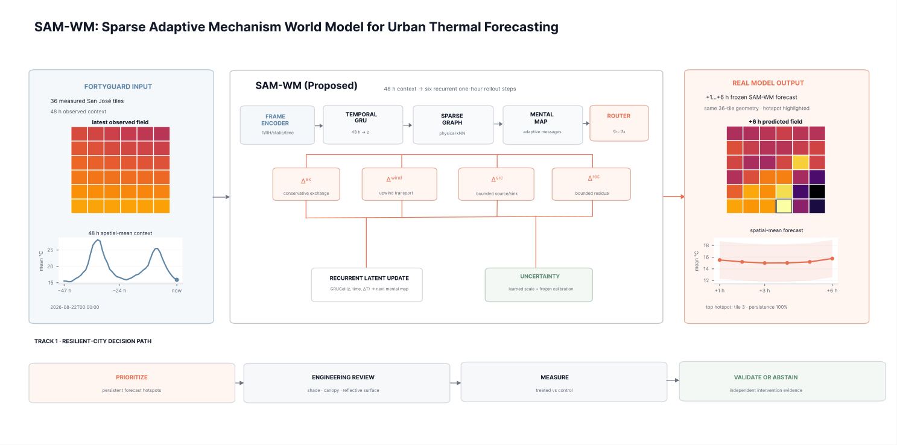
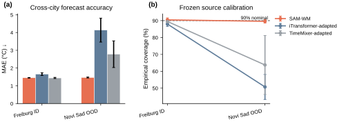
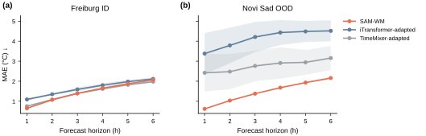
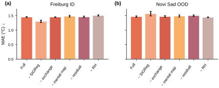
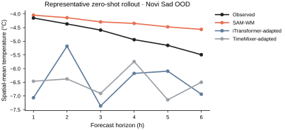

# SAM-WM · CoolWorld

**Sparse Adaptive Mechanism World Model for urban thermal forecasting**

**Krsna · FortyGuard Hackathon'26 · Track 1 — Resilient Cities & Infrastructure**

<p align="center">
  <b><a href="https://sam-wm-coolworld.onrender.com/">Live Demo</a> · <a href="results/paper_suite/paper_suite_results.json">Results</a> · <a href="docs/architecture/samwm_system_architecture.svg">Architecture</a></b>
</p>

SAM-WM is a compact world model for short-horizon urban thermal forecasting. It represents an urban sensor field as a sparse physical graph, encodes a 48-hour observation context, routes four typed thermal updates, and rolls the latent state forward recurrently for six one-hour forecast steps. CoolWorld connects that forecast to a resilient-city workflow: persistent heat is prioritized for engineering review, while intervention effects remain outside the model until treated/control measurements exist.

The implementation contains **117,705 trainable parameters** in the final paper configuration.

## Architecture

<p align="center">
  
</p>

The architecture follows the executed data path. The left panel contains recorded FortyGuard Temperature API evidence over a 36-tile San José grid and the preceding 48-hour thermal context. Each frame is encoded from dynamic observations, city-centred static geometry, and cyclical time features. A temporal GRU summarizes the history; sparse message passing then updates a latent mental map on the deterministic physical kNN graph. At every forecast step, a router assigns state- and time-dependent weights to conservative exchange, optional upwind transport, bounded source/sink forcing, and bounded residual correction. The resulting temperature increment updates both the field and the recurrent latent state. A separate scale head provides forecast uncertainty. The right panel shows the frozen +1…+6 h model forecast and persistent-hotspot output used by CoolWorld.

The lower path is deliberately outside the forecasting model: **prioritize → engineering review → measure treated vs control → validate or abstain**. SAM-WM therefore predicts where heat may persist; it does not infer the cooling effect of an unmeasured intervention.

## Method

Let $G=(V,E)$ be the sparse city graph, $T_i^t$ the normalized temperature at node $i$, $z_i^t$ its latent state, and $\tau^t$ the daily/annual cyclical time encoding. The router produces four non-negative mechanism weights:

```math
\boldsymbol{\alpha}_i^t
=
\operatorname{softmax}
\left(
r_\theta\!\left([z_i^t,\tau^t]\right)
\right),
\qquad
\boldsymbol{\alpha}_i^t
=
\left[
\alpha_i^{\mathrm{ex}},
\alpha_i^{\mathrm{wind}},
\alpha_i^{\mathrm{src}},
\alpha_i^{\mathrm{res}}
\right].
```

When future wind is unavailable, the wind logit is masked before the softmax, so $\alpha_i^{\mathrm{wind}}=0$ exactly.

For an undirected physical edge $(i,j)$, the exchange operator learns a non-negative symmetric conductance and applies an antisymmetric pair flux:

```math
F_{ij}^{t}
=
\kappa_{ij}^{t}
\left(T_j^t-T_i^t\right),
\qquad
\Delta_{i,\mathrm{ex}}^{t}
=
\sum_{j:(i,j)\in E} F_{ij}^{t},
```

with the opposite contribution applied at node $j$. Consequently, the exchange term alone has zero global sum up to floating-point error. Wind transport uses an analogous conservative edge update with an upwind temperature when wind observations are available.

The local forcing terms are bounded:

```math
\Delta_{i,\mathrm{src}}^{t}
=
\alpha_i^{\mathrm{src}}
\, b_{\mathrm{src}}\,
\tanh
\left(
s_\theta([z_i^t,\tau^t])
\right),
```

```math
\Delta_{i,\mathrm{res}}^{t}
=
\alpha_i^{\mathrm{res}}
\, \rho\, b_{\mathrm{src}}\,
\tanh
\left(
q_\theta([z_i^t,\tau^t])
\right),
\qquad
\rho=0.20.
```

The one-step field update implemented in `src/coolworld/samwm.py` is therefore

```math
\boxed{
T_i^{t+1}
=
T_i^t
+
\Delta_{i,\mathrm{ex}}^{t}
+
\Delta_{i,\mathrm{wind}}^{t}
+
\Delta_{i,\mathrm{src}}^{t}
+
\Delta_{i,\mathrm{res}}^{t}
}
```

followed by recurrent latent dynamics and another sparse-map update:

```math
\tilde z_i^{t+1}
=
\operatorname{GRUCell}
\left(
[z_i^t,\tau^t,\Delta T_i^t],
z_i^t
\right),
\qquad
z^{t+1}
=
\mathcal{M}_\theta
\left(
\tilde z^{t+1},G
\right).
```

The uncertainty head predicts a Laplace log-scale for each node and horizon. Training combines latent prediction, Laplace negative log-likelihood, and an attributed SIGReg term:

```math
\mathcal{L}
=
\mathcal{L}_{\mathrm{latent}}
+
\mathcal{L}_{\mathrm{Laplace}}
+
\lambda_{\mathrm{sig}}\,
\mathcal{L}_{\mathrm{SIGReg}}.
```

SIGReg is adapted from LeJEPA/LeWM and is not claimed as an original contribution. The SAM-WM contribution is the sparse continuous-field representation with routed, bounded mechanisms and the evidence-bounded forecast/deployment interface.

## Experiments

### Protocol

All learned systems use the same source-only evaluation protocol. Freiburg is the only training domain; checkpoint selection and uncertainty calibration use Freiburg validation data only. Novi Sad is opened only for zero-shot evaluation, with no target fine-tuning and no target recalibration.

| Item | Setting |
|---|---|
| Context | 48 h |
| Forecast horizon | +1…+6 h |
| Physical graph | kNN, $k=4$ |
| SAM-WM hidden dimension | 64 |
| Source-bound quantile | 0.995 |
| Residual fraction $\rho$ | 0.20 |
| SIGReg coefficient | 0.01 |
| SIGReg projections | 256 |
| Batch size | 64 |
| Maximum epochs | 80 |
| Early-stopping patience | 10 |
| Learning rate | $3\times10^{-4}$ |
| Weight decay | $1\times10^{-4}$ |
| Gradient clipping | 1.0 |
| Conformal $\alpha$ | 0.10 |
| Seeds | 17, 29, 42, 73, 101 |
| Kaggle accelerator | 2 × Tesla T4 available; CUDA 12.8 |
| Paper-suite fits | 8 model/ablation families × 5 seeds = 40 |

The paper-suite configuration is tracked in [`config/paper.yaml`](config/paper.yaml). The Kaggle runtime recorded PyTorch 2.10.0+cu128 and Tesla T4 hardware. The training code does not make a distributed-data-parallel performance claim; the fixed data splits, seeds, configuration, checkpoints, and machine-readable results define the reproducibility contract.

### Freiburg held-out and Novi Sad zero-shot transfer

<p align="center">
  
</p>

| Model | Freiburg MAE °C ↓ | Freiburg RMSE °C ↓ | Freiburg coverage | Novi Sad MAE °C ↓ | Novi Sad RMSE °C ↓ | Novi Sad coverage |
|---|---:|---:|---:|---:|---:|---:|
| **SAM-WM** | 1.4515 ± 0.0149 | 2.0483 ± 0.0072 | **90.45% ± 1.13%** | **1.4675 ± 0.0256** | **2.1575 ± 0.0331** | **89.59% ± 0.99%** |
| iTransformer task adapter | 1.6560 ± 0.0758 | 2.2879 ± 0.0997 | 87.96% ± 1.39% | 4.1367 ± 0.6737 | 5.1015 ± 0.7979 | 50.71% ± 7.42% |
| TimeMixer task adapter | **1.4424 ± 0.0326** | **2.0023 ± 0.0484** | 89.49% ± 0.62% | 2.7799 ± 0.7516 | 3.4389 ± 0.7675 | 63.73% ± 17.47% |

TimeMixer is marginally lower in Freiburg MAE, so the experiment does not support a universal source-domain superiority claim. The notable result is transfer: SAM-WM changes from 1.4515 °C MAE in Freiburg to 1.4675 °C in Novi Sad, whereas the two task adapters degrade substantially under the same source-only protocol.

The iTransformer and TimeMixer systems in this repository are task-specific implementations based on the published architectures. They are not presented as reproductions of the authors' official repositories or as official benchmark numbers.

### Horizon-wise error

<p align="center">
  
</p>

Bands show the standard deviation across the five frozen seeds.

### Ablations

<p align="center">
  
</p>

| Variant | Freiburg MAE ↓ | Novi Sad MAE ↓ | Observation |
|---|---:|---:|---|
| **SAM-WM** | 1.4515 | 1.4675 | full model |
| − SIGReg | **1.3022** | 1.5669 | lower source error, weaker transfer/calibration |
| − exchange | 1.4494 | 1.4715 | aggregate MAE essentially unchanged |
| − mental map | 1.4807 | 1.4872 | higher error in both domains |
| − residual | 1.4572 | 1.5008 | larger degradation OOD |
| − RH | 1.5065 | **1.4434** | exposes source/target modality mismatch |

The exchange operator is justified here by its structural conservation property, not by an observed aggregate-MAE improvement.

### Representative Novi Sad rollout

<p align="center">
  
</p>

[`efficiency.svg`](results/paper_suite/figures/efficiency.svg) and [`learning_curves.svg`](results/paper_suite/figures/learning_curves.svg) are retained as supplementary diagnostics. Five paper figures are direct SVG exports from the completed Kaggle archive. `forecast_trace.svg` is a layout-only rerender from the exact stored trace arrays to move its legend outside the data region; no target, prediction, seed, split, or metric was changed.

## FortyGuard integration

CoolWorld uses the FortyGuard Temperature API as the deployment evidence source. The repository contains **65 recorded hourly TCM frames** over a single **36-tile San José, California** grid. Requests and completed responses are content-addressed, and the public application uses recorded evidence by default. No provider API key is committed or exposed in the browser.

One tracked request is stored at [`artifacts/fortyguard/f5f0fdf137c5dedfef886e8dba32b5038b97f247640328110c67acbff8e096ee.activity.json`](artifacts/fortyguard/f5f0fdf137c5dedfef886e8dba32b5038b97f247640328110c67acbff8e096ee.activity.json):

```json
{
  "analytic_type": "tcm",
  "date_time": {
    "filter_type": 1,
    "start_date": "2026-08-21",
    "start_time": "14:00"
  },
  "granularity": 100,
  "polygon_aoi": {
    "type": "FeatureCollection",
    "features": [
      {
        "properties": {
          "name": "SAM-WM San Jose integration AOI"
        },
        "geometry": {
          "type": "Polygon",
          "coordinates": "see tracked request"
        }
      }
    ]
  }
}
```

Request SHA-256:

```text
f5f0fdf137c5dedfef886e8dba32b5038b97f247640328110c67acbff8e096ee
```

The completed response is stored at [`artifacts/fortyguard/responses/5ba0d757a5ff2bd010f191fb1a1080a43cf7d408443554e3cb22ef25b1e7eca3.json`](artifacts/fortyguard/responses/5ba0d757a5ff2bd010f191fb1a1080a43cf7d408443554e3cb22ef25b1e7eca3.json):

```json
{
  "data": {
    "activity_id": "485b7652-5225-4944-a822-cd8189af4d91",
    "result": {
      "map_data": {
        "features": [
          {
            "id": "0",
            "properties": {
              "average_temperature": 24.3268,
              "max_temperature": 24.3268,
              "min_temperature": 24.3268,
              "tile_id": 0
            }
          }
        ]
      }
    }
  }
}
```

Response SHA-256:

```text
5ba0d757a5ff2bd010f191fb1a1080a43cf7d408443554e3cb22ef25b1e7eca3
```

`src/coolworld/fortyguard.py` records request intent before submission, retains the returned activity identifier, resumes polling without silently repeating an ambiguous request, hashes completed responses, and fails closed when evidence does not match its manifest.

## Deployment status

The live application presents four stages: **Observe → Forecast → Prioritize → Evidence**. Observed provider evidence and model forecasts are visually separated, and forecast output is labelled as research prediction rather than measurement.

The promoted deployment checkpoint was replayed without retraining on the recorded FortyGuard timeline:

| Item | Result |
|---|---:|
| Context | 48 h |
| Forecast horizon | 6 h |
| Provider windows | 12 |
| MAE | 2.047516 °C |
| RMSE | 2.501741 °C |
| Conformal radius | 3.211550 °C |
| Empirical coverage | **79.899691%** |
| Fixed minimum | **80.000000%** |
| Operational certification | **FAIL** |

The fixed threshold is not modified after evaluation. CoolWorld therefore exposes this checkpoint as a **research forecast**, not an operationally certified temperature forecast.

## Installation

Python **3.11 or 3.12** is supported.

```bash
git clone https://github.com/AnnyaB/SAM-WM.git
cd SAM-WM

python3.11 -m venv .venv
source .venv/bin/activate
python -m pip install --upgrade pip
python -m pip install -e '.[dev,app]'

make verify
python verify_runtime.py
make serve
```

Open `http://127.0.0.1:8000`.

Docker:

```bash
docker build -t sam-wm-coolworld .
docker run --rm -p 7860:7860 \
  -e COOLWORLD_LIVE_API_ENABLED=0 \
  sam-wm-coolworld
```

Open `http://127.0.0.1:7860`.

## Training and reproduction

A single SAM-WM run:

```bash
python train.py --seed 17
```

Final paper suite:

```bash
python paper_suite.py \
  --config config/paper.yaml \
  --mode paper \
  --skip-fairurb \
  --out artifacts/paper_suite
```

Publication figures:

```bash
python scripts/plot_results.py \
  --results artifacts/paper_suite/paper_suite_results.json \
  --root artifacts/paper_suite \
  --out artifacts/paper_suite/figures
```

The completed deadline archive contains all 40 checkpoints, all 40 training histories, and PDF/SVG/600-dpi PNG exports of all six figure families. The lightweight repository export is under [`results/paper_suite/`](results/paper_suite/), including the exact machine-readable result object and selected SAM-WM checkpoint.

The final paper checkpoint is [`results/paper_suite/checkpoints/samwm_seed42_best.pt`](results/paper_suite/checkpoints/samwm_seed42_best.pt), selected by Freiburg validation MAE only. SHA-256:

```text
d29e2939f86e7d6961dd16b6d2e5e20a2868d1c003825ef5c0ad2eae996f18dc
```

The public application uses a separate hash-locked deployment bundle in `artifacts/deployment/`; the paper checkpoint must not replace it without regenerating and validating the deployment calibration/evaluation chain.

## Repository layout

```text
SAM-WM/
├── src/coolworld/          # model, data, graph, evaluation and application code
├── config/                 # frozen training and paper-suite configurations
├── static/                 # CoolWorld browser interface
├── tests/                  # unit and contract tests
├── notebooks/              # Kaggle execution notebook
├── scripts/                # paper-suite import/plot utilities
├── artifacts/              # provider and deployment evidence
├── results/paper_suite/    # final machine-readable results, checkpoint and figures
├── docs/architecture/      # exact publication architecture SVG
├── Dockerfile
├── Makefile
├── pyproject.toml
└── README.md
```

Core executable entry points are retained at repository root because the Makefile and CI compile or invoke them directly.

## Limitations

- The provider replay reaches 79.899691% empirical coverage against a fixed 80% operational threshold; the current deployment is therefore not operationally certified.
- No independent treated/control intervention dataset is present, so the repository does not report a causal temperature reduction for trees, shade, reflective materials, or other physical interventions.
- The iTransformer and TimeMixer comparison systems are task adapters, not official-author code reproductions.
- The final deadline paper suite reports one unseen-city evaluation, Novi Sad. Turku was deferred when the FAIRUrbTemp host was unavailable during the final run.
- Conservative exchange is structurally conservative but does not produce a material aggregate-MAE improvement in the present ablation.
- Relative-humidity availability differs between source and target data; the −RH experiment exposes this modality shift.

## Development and disclosure

The repository was created during the FortyGuard Hackathon build window. The FortyGuard client is a custom integration rather than a clone of the Temperature API Quickstart.

AI-assisted tools were used for code review, debugging, testing, documentation editing, and figure-layout review. Training outputs, provider responses, model checkpoints, benchmark values, thresholds, and reported figures come from the tracked execution artifacts.

## References

### Urban temperature data

1. M. Plein, G. Feigel, M. Zeeman, C. Dormann, and A. Christen. **Street-level weather station network in Freiburg, Germany: Curated dataset from 2022-09-01 to 2023-08-31 [L2]**. Zenodo (2024). [doi:10.5281/zenodo.12732565](https://doi.org/10.5281/zenodo.12732565)
2. S. Savić, I. Šećerov, J. Dunjić, and D. Milošević. **Hourly Air Temperature Datasets from city of Novi Sad — NSUNET system**. Zenodo (2023). [doi:10.5281/zenodo.7738094](https://doi.org/10.5281/zenodo.7738094)
3. S. Amini, A. Huerta, J. Franke, et al. **Comprehensive compilation and quality assessment of street-level urban air temperature measurements across European networks**. *Scientific Data* 13, 658 (2026). [doi:10.1038/s41597-026-06804-4](https://doi.org/10.1038/s41597-026-06804-4)

### Forecasting and world models

4. D. Ha and J. Schmidhuber. **World Models**. arXiv preprint (2018). [arXiv:1803.10122](https://arxiv.org/abs/1803.10122)
5. Y. Liu, T. Hu, H. Zhang, H. Wu, S. Wang, L. Ma, and M. Long. **iTransformer: Inverted Transformers Are Effective for Time Series Forecasting**. ICLR 2024. [arXiv:2310.06625](https://arxiv.org/abs/2310.06625)
6. S. Wang, H. Wu, X. Shi, T. Hu, H. Luo, L. Ma, J. Y. Zhang, and J. Zhou. **TimeMixer: Decomposable Multiscale Mixing for Time Series Forecasting**. ICLR 2024. [arXiv:2405.14616](https://arxiv.org/abs/2405.14616)
7. J. Baek, Y.-F. Wu, G. Singh, and S. Ahn. **Dreamweaver: Learning Compositional World Models from Pixels**. ICLR 2025. [arXiv:2501.14174](https://arxiv.org/abs/2501.14174) · [OpenReview](https://openreview.net/forum?id=e5mTvjXG9u)
8. R. Balestriero and Y. LeCun. **LeJEPA: Provable and Scalable Self-Supervised Learning Without the Heuristics**. 2025. [arXiv:2511.08544](https://arxiv.org/abs/2511.08544)
9. L. Maes, Q. Le Lidec, D. Scieur, Y. LeCun, and R. Balestriero. **LeWorldModel: Stable End-to-End Joint-Embedding Predictive Architecture from Pixels**. 2026. [arXiv:2603.19312](https://arxiv.org/abs/2603.19312)
10. D. Baek, G. Lee, J. Baek, H. Lee, and S. Ahn. **Learning to Theorize the World from Observation**. ICML 2026 Oral. [arXiv:2605.03413](https://arxiv.org/abs/2605.03413)

### Learned weather dynamics

11. R. Lam, A. Sanchez-Gonzalez, M. Willson, et al. **Learning skillful medium-range global weather forecasting** (GraphCast). *Science* 382, 1416–1421 (2023). [doi:10.1126/science.adi2336](https://doi.org/10.1126/science.adi2336)
12. D. Kochkov, J. Yuval, I. Langmore, et al. **Neural general circulation models for weather and climate**. *Nature* 632, 1060–1066 (2024). [doi:10.1038/s41586-024-07744-y](https://doi.org/10.1038/s41586-024-07744-y)
13. I. Price, A. Sanchez-Gonzalez, F. Alet, et al. **Probabilistic weather forecasting with machine learning** (GenCast). *Nature* 637, 84–90 (2025). [doi:10.1038/s41586-024-08252-9](https://doi.org/10.1038/s41586-024-08252-9)

## License

See [`LICENSE`](LICENSE).
