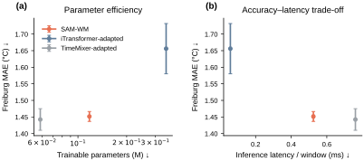
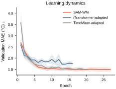

# CoolWorld: Sparse Adaptive Mechanism World Model for Urban Heat Forecasting

<p align="center">
  <video
    src=https://github.com/user-attachments/assets/2b27a7f3-0f87-4213-9580-180f6c66baf4
    width="450"
    controls
    playsinline>
  </video>
</p>


**FortyGuard Hackathon'26**  
**Primary track:** Track 5 — Model Designing · **Secondary track:** Track 1 — Resilient Cities & Infrastructure

<p align="center">
  <a href="https://sam-wm-coolworld.onrender.com/"><strong>Live Demo</strong></a>
</p>

<p align="center">
  <a href="#problem-and-user">Problem</a> ·
  <a href="#existing-approaches-and-research-gap">Research Gap</a> ·
  <a href="#proposed-method">Method</a> ·
  <a href="#architecture">Architecture</a> ·
  <a href="#experiments-and-results">Results</a> ·
  <a href="#discussion">Discussion</a> ·
  <a href="#demo-guide">Demo Guide</a> ·
  <a href="#run-from-scratch">Run</a> ·
  <a href="#references">References</a>
</p>

CoolWorld turns real FortyGuard temperature evidence into uncertainty-aware short-horizon urban heat forecasts and persistent-hotspot priorities. Its forecasting engine, **Sparse Adaptive Mechanism World Model (SAM-WM)**, represents an urban thermal field as a sparse physical graph, learns recurrent latent dynamics, and composes bounded thermal mechanisms over six one-hour forecast steps. The final configuration contains **117,705 trainable parameters**.

## Problem and user

Urban heat varies across both space and time. A city-wide temperature statistic can therefore hide street-level and neighborhood-scale thermal differences that matter to infrastructure planning. Resilience teams need not only to observe where heat is high now, but also to identify which locations are likely to remain relatively hot over the next several hours.

**CoolWorld is designed for municipal resilience, public-works, and climate-adaptation engineering teams.** Its decision problem is deliberately narrow:

> Given recent hyperlocal temperature evidence, which locations deserve engineering attention first because heat is predicted to persist?

FortyGuard supplies the deployment evidence layer. SAM-WM supplies the short-horizon predictive model. CoolWorld then ranks persistent future hotspots while keeping observation, prediction, operational certification, and causal intervention evidence explicitly separate.

## Existing approaches and research gap

Learned forecasting spans several regimes. iTransformer and TimeMixer provide strong generic time-series architectures (Liu *et al.*, 2024; Wang *et al.*, 2024). GraphCast, NeuralGCM, and GenCast demonstrate learned forecasting at large meteorological scales (Lam *et al.*, 2023; Kochkov *et al.*, 2024; Price *et al.*, 2025). World-model research has separately explored compact recurrent dynamics, compositional structure, and learned predictive representations (Ha and Schmidhuber, 2018; Baek *et al.*, 2025; Baek *et al.*, 2026).

These systems solve different forecasting problems. Generic time-series architectures do not, by construction, impose SAM-WM's sparse physical graph together with explicitly routed conservative exchange, optional transport, bounded local forcing, and bounded residual dynamics. Global learned weather systems operate at a fundamentally different spatial and deployment scale from a small hyperlocal urban thermal field. Pixel-based world models target visual dynamics rather than irregular temperature observations attached to physical city geometry.

The Proposed **Sparse Adaptive Mechanism World Model** (SAM-WM) therefore studies a narrower question:

> **Can a compact, structured world model forecast a sparse urban thermal field while preserving uncertainty, transfer evidence, and a strict boundary between prediction and causal intervention claims?**

The experiments test whether this inductive structure is useful under a controlled source-only urban-temperature forecasting protocol and whether it transfers to an unseen city without target fine-tuning.

## Proposed method

Let $G=(V,E)$ be the sparse city graph, $T_i^t$ the normalized temperature at node $i$, $z_i^t$ its latent state, and $\tau^t$ the daily/annual cyclical time encoding.

The adaptive router produces four non-negative mechanism weights:

```math
\boldsymbol{\alpha}_i^t
=
\mathrm{softmax}\!\left(r_\theta([z_i^t,\tau^t])\right),
\qquad
\boldsymbol{\alpha}_i^t
=
\left[
\alpha_i^{\mathrm{ex}},
\alpha_i^{\mathrm{wind}},
\alpha_i^{\mathrm{src}},
\alpha_i^{\mathrm{res}}
\right].
```

When future wind is unavailable, the wind logit is masked before the softmax, so $\alpha_i^{\mathrm{wind}}=0$ exactly.

For an undirected physical edge $(i,j)$, the exchange operator learns a non-negative symmetric conductance and applies an antisymmetric pair flux:

```math
F_{ij}^{t}
=
\kappa_{ij}^{t}\left(T_j^t-T_i^t\right),
\qquad
\Delta_{i,\mathrm{ex}}^{t}
=
\sum_{j:(i,j)\in E}F_{ij}^{t}.
```

The opposite contribution is applied at node $j$. Consequently, the exchange term alone has zero global sum up to floating-point error. Wind transport uses an analogous conservative edge update with an upwind temperature when wind observations are available.

The local forcing terms are bounded:

```math
\Delta_{i,\mathrm{src}}^{t}
=
\alpha_i^{\mathrm{src}}\,b_{\mathrm{src}}\,
\mathrm{tanh}\!\left(s_\theta([z_i^t,\tau^t])\right),
```

```math
\Delta_{i,\mathrm{res}}^{t}
=
\alpha_i^{\mathrm{res}}\,\rho\,b_{\mathrm{src}}\,
\mathrm{tanh}\!\left(q_\theta([z_i^t,\tau^t])\right),
\qquad
\rho=0.20.
```

The one-step thermal field update implemented in `src/coolworld/samwm.py` is

```math
\boxed{
T_i^{t+1}
=
T_i^t
+
\Delta_{i,\mathrm{ex}}^{t}
+
\Delta_{i,\mathrm{wind}}^{t}
+
\Delta_{i,\mathrm{src}}^{t}
+
\Delta_{i,\mathrm{res}}^{t}
}.
```

The recurrent latent state is then updated and passed through the sparse mental map again:

```math
\widetilde{z}_i^{t+1}
=
\mathrm{GRUCell}\!\left([z_i^t,\tau^t,\Delta T_i^t],z_i^t\right),
\qquad
z^{t+1}
=
\mathcal{M}_\theta\!\left(\widetilde{z}^{t+1},G\right).
```

The uncertainty head predicts a Laplace log-scale for each node and horizon. Training combines latent prediction, Laplace negative log-likelihood, and SIGReg:

```math
\mathcal{L}
=
\mathcal{L}_{\mathrm{latent}}
+
\mathcal{L}_{\mathrm{Laplace}}
+
\lambda_{\mathrm{sig}}\mathcal{L}_{\mathrm{SIGReg}}.
```

SIGReg is adapted from LeJEPA/LeWM. The SAM-WM contribution is the sparse continuous-field representation with routed, bounded mechanisms and the evidence-bounded forecast/deployment interface.

### Causal Action Nonparametric Difference-in-Differences with Robust Abstention (CANDRA)

CANDRA is **not** part of SAM-WM training and does not alter the ordinary +1…+6 h forecast. It is a downstream evidence gate used only after a real physical intervention has independent treated/control measurements.

For each horizon $h$, the implementation in `src/coolworld/candra.py` forms the difference-in-differences contrast

```math
D_{h,n}
=
\left(T^{\mathrm{tr}}_{h,n,\mathrm{post}}-T^{\mathrm{tr}}_{h,n,\mathrm{pre}}\right)
-
\left(T^{\mathrm{ct}}_{h,n,\mathrm{post}}-T^{\mathrm{ct}}_{h,n,\mathrm{pre}}\right),
```

and estimates the intervention effect as

```math
\widehat{\delta}_h
=
\frac{1}{N_h}\sum_{n=1}^{N_h}D_{h,n}.
```

A temporal block bootstrap produces the 95% interval $[L_h,U_h]$. Cooling is supported at horizon $h$ only when

```math
U_h < 0.
```

`src/coolworld/action_evidence.py` requires this condition at **every requested horizon in both a source study and an independent transfer study** before an action artifact can set `transfer_validated=true`. At runtime, `src/coolworld/deployment.py` additionally checks the requested action, horizon, coverage regime, provenance, interval ordering, and evidence support before any counterfactual action effect can be applied.

The current public deployment intentionally has **no `candra_actions.json` artifact**, because no independent treated/control intervention dataset is present.

## Architecture


The architecture follows the executed data path. The left panel contains recorded FortyGuard Temperature API evidence over a 36-tile San José grid and the preceding 48-hour thermal context. Each frame is encoded from dynamic observations, city-centred static geometry, and cyclical time features. A temporal GRU summarizes the history; sparse message passing then updates a latent mental map on the deterministic physical kNN graph. At every forecast step, a router assigns state- and time-dependent weights to conservative exchange, optional upwind transport, bounded source/sink forcing, and bounded residual correction. The resulting temperature increment updates both the field and the recurrent latent state. A separate scale head provides forecast uncertainty. The frozen model rolls forward recurrently for +1…+6 h.

The intervention pathway shown in the architecture remains downstream of forecasting: hotspot prioritization is followed by engineering review, treated/control measurement, and CANDRA validation or abstention. SAM-WM therefore predicts where heat may persist; it does not infer the cooling effect of an unmeasured intervention.

## Experiments and results

### Training and evaluation protocol

Freiburg is the only training domain. Checkpoint selection and uncertainty calibration use Freiburg validation data only. Novi Sad is opened only for zero-shot evaluation, with no target fine-tuning and no target recalibration.

| Item | Setting |
|---|---|
| Context | 48 h |
| Forecast horizon | +1…+6 h |
| Physical graph | kNN, $k=4$ |
| SAM-WM hidden dimension | 64 |
| Source-bound quantile | 0.995 |
| Residual fraction $\rho$ | 0.20 |
| SIGReg coefficient | 0.01 |
| SIGReg projections | 256 |
| Batch size | 64 |
| Maximum epochs | 80 |
| Early-stopping patience | 10 |
| Learning rate | $3\times10^{-4}$ |
| Weight decay | $1\times10^{-4}$ |
| Gradient clipping | 1.0 |
| Conformal $\alpha$ | 0.10 |
| Seeds | 17, 29, 42, 73, 101 |
| Kaggle accelerator | 2 × Tesla T4 available; CUDA 12.8 |
| Kaggle PyTorch runtime | 2.10.0+cu128 |
| Paper-suite fits | 8 model/ablation families × 5 seeds = 40 |

The configuration is tracked in [`config/paper.yaml`](config/paper.yaml). The Kaggle runtime exposed two Tesla T4 GPUs. Reproducibility is defined by the fixed data splits, seeds, configuration, checkpoints, and machine-readable result artifacts.

### Freiburg held-out and Novi Sad zero-shot transfer


| Model | Freiburg MAE °C ↓ | Freiburg RMSE °C ↓ | Freiburg coverage | Novi Sad MAE °C ↓ | Novi Sad RMSE °C ↓ | Novi Sad coverage |
|---|---:|---:|---:|---:|---:|---:|
| **SAM-WM** | 1.4515 ± 0.0149 | 2.0483 ± 0.0072 | **90.45% ± 1.13%** | **1.4675 ± 0.0256** | **2.1575 ± 0.0331** | **89.59% ± 0.99%** |
| iTransformer task adapter | 1.6560 ± 0.0758 | 2.2879 ± 0.0997 | 87.96% ± 1.39% | 4.1367 ± 0.6737 | 5.1015 ± 0.7979 | 50.71% ± 7.42% |
| TimeMixer task adapter | **1.4424 ± 0.0326** | **2.0023 ± 0.0484** | 89.49% ± 0.62% | 2.7799 ± 0.7516 | 3.4389 ± 0.7675 | 63.73% ± 17.47% |

TimeMixer is marginally lower in Freiburg MAE, so the experiment does not support a universal source-domain superiority claim. The principal transfer observation is that SAM-WM changes from 1.4515 °C MAE in Freiburg to 1.4675 °C in Novi Sad, whereas the two comparison systems degrade substantially under the same source-only protocol.

The iTransformer and TimeMixer systems in this repository are implementations based on the published architectures. They are not presented as reproductions of the authors' official repositories or as official benchmark numbers.

### Horizon-wise error


Bands show the standard deviation across the five frozen seeds.

### Ablations


| Variant | Freiburg MAE ↓ | Novi Sad MAE ↓ | Observation |
|---|---:|---:|---|
| **SAM-WM** | 1.4515 | 1.4675 | full model |
| − SIGReg | **1.3022** | 1.5669 | lower source error, weaker transfer/calibration |
| − exchange | 1.4494 | 1.4715 | aggregate MAE essentially unchanged |
| − mental map | 1.4807 | 1.4872 | higher error in both domains |
| − residual | 1.4572 | 1.5008 | larger degradation OOD |
| − RH | 1.5065 | **1.4434** | exposes source/target modality mismatch |

The exchange operator is justified here by its structural conservation property, not by an observed aggregate-MAE improvement.

### Representative Novi Sad rollout


### Efficiency



### Learning curves



## Discussion

TimeMixer obtains a marginally lower Freiburg MAE. The more informative observation is cross-city behavior. SAM-WM changes from **1.4515 °C MAE** on Freiburg held-out data to **1.4675 °C MAE** on the unseen Novi Sad evaluation, while the two comparison systems degrade more strongly under the same source-only protocol.

The ablations also prevent an overly simple novelty claim. Removing SIGReg reduces Freiburg error but weakens transfer/calibration; removing the mental map increases error in both domains; removing the residual branch affects the unseen-city result more strongly. Conversely, removing exchange barely changes aggregate MAE. The exchange mechanism is therefore motivated by its structural conservation contract rather than by a claim that it alone improves aggregate accuracy.

The FortyGuard replay tests a different question from the benchmarks: whether the frozen deployment bundle is sufficiently calibrated on the real provider context. Its empirical coverage is **79.899691%** against a fixed **80.000000%** minimum. CoolWorld consequently keeps `operational_certified=false`; the threshold is not weakened after observing the result.

## FortyGuard integration

CoolWorld uses the FortyGuard Temperature API as the deployment evidence source. The repository contains **65 recorded hourly TCM frames** over a single **36-tile San José, California** grid. Requests and completed responses are content-addressed, and the public application uses recorded evidence by default.

The collector reads the participant credential only from the server-side `FORTYGUARD_API_KEY` environment variable and sends it in FortyGuard's required `api-key` header. The tracked completed request contains a provider-issued `activity_id` and a completed response artifact. 

One tracked request is stored at [`artifacts/fortyguard/f5f0fdf137c5dedfef886e8dba32b5038b97f247640328110c67acbff8e096ee.activity.json`](artifacts/fortyguard/f5f0fdf137c5dedfef886e8dba32b5038b97f247640328110c67acbff8e096ee.activity.json):

```json
{
  "analytic_type": "tcm",
  "date_time": {
    "filter_type": 1,
    "start_date": "2026-08-21",
    "start_time": "14:00"
  },
  "granularity": 100,
  "polygon_aoi": {
    "type": "FeatureCollection",
    "features": [
      {
        "properties": {
          "name": "SAM-WM San Jose integration AOI"
        },
        "geometry": {
          "type": "Polygon",
          "coordinates": "see tracked request"
        }
      }
    ]
  }
}
```

Request SHA-256:

```text
f5f0fdf137c5dedfef886e8dba32b5038b97f247640328110c67acbff8e096ee
```

The completed response is stored at [`artifacts/fortyguard/responses/5ba0d757a5ff2bd010f191fb1a1080a43cf7d408443554e3cb22ef25b1e7eca3.json`](artifacts/fortyguard/responses/5ba0d757a5ff2bd010f191fb1a1080a43cf7d408443554e3cb22ef25b1e7eca3.json):

```json
{
  "data": {
    "activity_id": "485b7652-5225-4944-a822-cd8189af4d91",
    "result": {
      "map_data": {
        "features": [
          {
            "id": "0",
            "properties": {
              "average_temperature": 24.3268,
              "max_temperature": 24.3268,
              "min_temperature": 24.3268,
              "tile_id": 0
            }
          }
        ]
      }
    }
  }
}
```

Response SHA-256:

```text
5ba0d757a5ff2bd010f191fb1a1080a43cf7d408443554e3cb22ef25b1e7eca3
```

`src/coolworld/fortyguard.py` records request intent before submission, retains the returned activity identifier, resumes polling without silently repeating an ambiguous request, hashes completed responses, and fails closed when evidence does not match its manifest.

## Deployment status

The live application presents four stages: **Observe → Forecast → Prioritize → Evidence**. Observed provider evidence and model forecasts are visually separated, and forecast output is labelled as research prediction rather than measurement.

The promoted deployment checkpoint was replayed without retraining on the recorded FortyGuard timeline:

| Item | Result |
|---|---:|
| Context | 48 h |
| Forecast horizon | 6 h |
| Provider windows | 12 |
| MAE | 2.047516 °C |
| RMSE | 2.501741 °C |
| Conformal radius | 3.211550 °C |
| Empirical coverage | **79.899691%** |
| Fixed minimum | **80.000000%** |
| Operational certification | **FAIL** |

The fixed threshold is not modified after evaluation.

## Demo guide

The public demo is designed to be judged without a login, installation, or API credential: [**Open CoolWorld**](https://sam-wm-coolworld.onrender.com/).

1. **Observe.** Select **OBSERVE** first. This view presents the recorded FortyGuard thermal evidence used by the deployment workflow: 65 recorded hourly frames over a fixed 36-tile San José grid. Interpret this stage as provider evidence, not a SAM-WM forecast.
2. **Forecast.** Select **FORECAST**. CoolWorld takes the latest valid 48-hour context and runs the frozen SAM-WM checkpoint recurrently for +1…+6 h. Forecast values and their uncertainty interval are displayed separately from observations. Interpret this as a research prediction, not a measurement or operational guarantee.
3. **Prioritize.** Select **PRIORITIZE**. Tiles are ranked using their predicted future temperature trajectory and persistence among the hotter part of the forecast field. Priority means that a location merits engineering investigation first; it does not mean that a particular intervention is already proven to reduce temperature by a specified amount.
4. **Evidence.** Select **EVIDENCE**. This stage exposes the benchmark and deployment evidence behind the forecast, including the frozen provider-replay result of **79.899691% empirical coverage against the predeclared 80.000000% minimum**. Operational certification therefore remains **FAIL**.

After a hotspot is identified, the intended next step is a human engineering review. If a physical intervention is implemented, comparable treated/control measurements are collected and passed through CANDRA. A numerical cooling effect is exposed only when the evidence contract is satisfied; otherwise the system abstains.

## Run from scratch

Python **3.11 or 3.12** is supported.

```bash
git clone --branch main --single-branch https://github.com/AnnyaB/SAM-WM.git
cd SAM-WM

PYTHON_BIN="$(command -v python3.12 || command -v python3.11 || true)"
if [ -z "$PYTHON_BIN" ]; then
  echo "Python 3.11 or 3.12 is required."
  exit 1
fi

"$PYTHON_BIN" -m venv .venv
source .venv/bin/activate
python --version
python -m pip install --upgrade pip
python -m pip install -e '.[dev,app]'

make verify
python scripts/verify_runtime.py
make serve
```

Open `http://127.0.0.1:8000`.

Docker:

```bash
docker build -t sam-wm-coolworld .
docker run --rm -p 7860:7860 \
  -e COOLWORLD_LIVE_API_ENABLED=0 \
  sam-wm-coolworld
```

Open `http://127.0.0.1:7860`.

## Training and reproduction

A single SAM-WM run:

```bash
python scripts/train.py --seed 17
```

Final paper suite:

```bash
python scripts/paper_suite.py \
  --config config/paper.yaml \
  --mode paper \
  --skip-fairurb \
  --out artifacts/paper_suite
```

Publication figures:

```bash
python scripts/plot_results.py \
  --results artifacts/paper_suite/paper_suite_results.json \
  --root artifacts/paper_suite \
  --out artifacts/paper_suite/figures
```

The final checkpoint is [`results/paper_suite/checkpoints/samwm_seed42_best.pt`](results/paper_suite/checkpoints/samwm_seed42_best.pt), selected by Freiburg validation MAE only. SHA-256:

```text
d29e2939f86e7d6961dd16b6d2e5e20a2868d1c003825ef5c0ad2eae996f18dc
```

The public application uses a separate hash-locked deployment bundle in `artifacts/deployment/`; the checkpoint must not replace it without regenerating and validating the deployment calibration/evaluation chain.

## Repository layout

| Path | Purpose |
|---|---|
| `src/coolworld/` | model, graph, data, evaluation, deployment, CANDRA, and application code |
| `scripts/` | training, evaluation, FortyGuard, deployment, CANDRA, verification, and figure CLIs |
| `config/` | frozen training and paper-suite configurations |
| `static/` | CoolWorld browser interface |
| `tests/` | unit, contract, runtime, and provider-integration tests |
| `notebooks/` | Kaggle execution notebook |
| `examples/` | reproducible San José AOI example |
| `artifacts/` | recorded FortyGuard evidence and frozen deployment artifacts |
| `results/paper_suite/` | final machine-readable results, selected checkpoint, and publication figures |
| `docs/architecture/` | exact final architecture SVG |
| `Dockerfile` | public-demo container definition |
| `Makefile` | verification, training, paper-suite, and serving commands |
| `pyproject.toml` | package metadata and dependencies |

All executable research and deployment utilities are consolidated under `scripts/`; the repository root is reserved for project metadata and build/runtime entry files.

## Limitations and future work

### Limitations

- The provider replay reaches 79.899691% empirical coverage against a fixed 80% operational threshold; the current deployment is therefore not operationally certified.
- No independent treated/control intervention dataset is present, so the repository does not report a causal temperature reduction for trees, shade, reflective materials, or other physical interventions; the CANDRA action gate therefore remains closed in the public runtime.
- The iTransformer and TimeMixer comparison systems are task adapters, not official-author code reproductions.
- Conservative exchange is structurally conservative but does not produce a material aggregate-MAE improvement in the present ablation.
- Relative-humidity availability differs between source and target data; the −RH experiment exposes this modality shift.

### Future work

Immediate research priorities are to evaluate additional unseen cities when the required source data are available, improve deployment-domain calibration without changing thresholds after evaluation, and collect genuine treated/control intervention datasets for CANDRA. A later engineering deployment should additionally incorporate site constraints, intervention cost, permissions, maintenance requirements, and longitudinal post-intervention monitoring.

## References

Amini, S., Huerta, A., Franke, J. *et al.* (2026) 'Comprehensive compilation and quality assessment of street-level urban air temperature measurements across European networks', *Scientific Data*, 13, 658. Available at: [https://doi.org/10.1038/s41597-026-06804-4](https://doi.org/10.1038/s41597-026-06804-4).

Baek, D., Lee, G., Baek, J., Lee, H. and Ahn, S. (2026) 'Learning to Theorize the World from Observation', *Proceedings of the 43rd International Conference on Machine Learning (ICML 2026)*, Oral. Available at: [https://arxiv.org/abs/2605.03413](https://arxiv.org/abs/2605.03413).

Baek, J., Wu, Y.-F., Singh, G. and Ahn, S. (2025) 'Dreamweaver: Learning Compositional World Models from Pixels', *The Thirteenth International Conference on Learning Representations (ICLR 2025)*. Available at: [https://arxiv.org/abs/2501.14174](https://arxiv.org/abs/2501.14174) and [OpenReview](https://openreview.net/forum?id=e5mTvjXG9u).

Balestriero, R. and LeCun, Y. (2025) 'LeJEPA: Provable and Scalable Self-Supervised Learning Without the Heuristics', arXiv preprint arXiv:2511.08544. Available at: [https://arxiv.org/abs/2511.08544](https://arxiv.org/abs/2511.08544).

Ha, D. and Schmidhuber, J. (2018) 'World Models', arXiv preprint arXiv:1803.10122. Available at: [https://arxiv.org/abs/1803.10122](https://arxiv.org/abs/1803.10122).

Kochkov, D., Yuval, J., Langmore, I. *et al.* (2024) 'Neural general circulation models for weather and climate', *Nature*, 632, pp. 1060–1066. Available at: [https://doi.org/10.1038/s41586-024-07744-y](https://doi.org/10.1038/s41586-024-07744-y).

Lam, R., Sanchez-Gonzalez, A., Willson, M. *et al.* (2023) 'Learning skillful medium-range global weather forecasting', *Science*, 382, pp. 1416–1421. Available at: [https://doi.org/10.1126/science.adi2336](https://doi.org/10.1126/science.adi2336).

Liu, Y., Hu, T., Zhang, H., Wu, H., Wang, S., Ma, L. and Long, M. (2024) 'iTransformer: Inverted Transformers Are Effective for Time Series Forecasting', *The Twelfth International Conference on Learning Representations (ICLR 2024)*. Available at: [https://arxiv.org/abs/2310.06625](https://arxiv.org/abs/2310.06625).

Maes, L., Le Lidec, Q., Scieur, D., LeCun, Y. and Balestriero, R. (2026) 'LeWorldModel: Stable End-to-End Joint-Embedding Predictive Architecture from Pixels', arXiv preprint arXiv:2603.19312. Available at: [https://arxiv.org/abs/2603.19312](https://arxiv.org/abs/2603.19312).

Plein, M., Feigel, G., Zeeman, M., Dormann, C. and Christen, A. (2024) *Street-level weather station network in Freiburg, Germany: Curated dataset from 2022-09-01 to 2023-08-31 [L2]*. Zenodo. Available at: [https://doi.org/10.5281/zenodo.12732565](https://doi.org/10.5281/zenodo.12732565).

Price, I., Sanchez-Gonzalez, A., Alet, F. *et al.* (2025) 'Probabilistic weather forecasting with machine learning', *Nature*, 637, pp. 84–90. Available at: [https://doi.org/10.1038/s41586-024-08252-9](https://doi.org/10.1038/s41586-024-08252-9).

Savić, S., Šećerov, I., Dunjić, J. and Milošević, D. (2023) *Hourly Air Temperature Datasets from city of Novi Sad — NSUNET system*. Zenodo. Available at: [https://doi.org/10.5281/zenodo.7738094](https://doi.org/10.5281/zenodo.7738094).

Wang, S., Wu, H., Shi, X., Hu, T., Luo, H., Ma, L., Zhang, J.Y. and Zhou, J. (2024) 'TimeMixer: Decomposable Multiscale Mixing for Time Series Forecasting', *The Twelfth International Conference on Learning Representations (ICLR 2024)*. Available at: [https://arxiv.org/abs/2405.14616](https://arxiv.org/abs/2405.14616).

## License

See [`LICENSE`](LICENSE).
